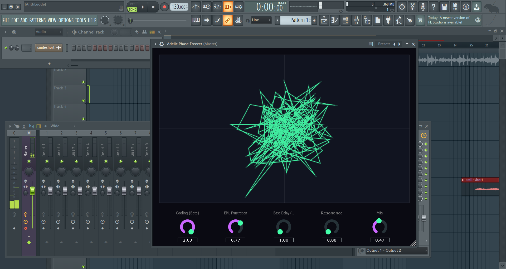

# Adélic Phase Freezer

## A Topological Distortion & Bost-Connes Resonator

The Adélic Phase Freezer is a completely novel digital signal processing
(DSP) audio plugin built in C++ / JUCE. It abandons standard amplitude
and EQ processing to operate purely on the **phase topology** of the
audio signal.

By translating the mathematics of quantum thermodynamics and prime
number theory into an audio buffer, this plugin bridges the gap between
an ergodic, non-repeating reverb and a mathematically locked, pitched
resonator.

------------------------------------------------------------------------

## 🎛️ The Concept

Standard audio plugins treat audio as a 1D line over time. The Phase
Freezer uses a **Takens Delay Embedding** to unfold the incoming audio
into a 2D complex phase space:

Z = Real + i · Imaginary

Once unfolded into geometry, the plugin applies the **Bost-Connes Phase
Transition**:

-   **The Prime Arm (Ergodic)**\
    Audio is routed through delay lines whose lengths are strictly prime
    numbers.\
    Because primes share no divisors, they never harmonically resonate.\
    Result: an infinitely dense, metallic, non-repeating smear.

-   **The Harmonic Arm (Locked)**\
    Audio is routed through delay lines based on integer harmonics.

-   **The EML Gate**\
    A topological wavefolder that distorts based on distance to the EML
    Zero Manifold:

    \|Z\| - arg(Z)

    It clips only when amplitude and phase fall out of alignment.

------------------------------------------------------------------------

## 🕹️ Controls

-   **Cooling (Beta)**\
    Master macro control.

    -   0.0 → chaotic prime-field wash\
    -   1.0+ → crystallized harmonic resonance

-   **EML Frustration**\
    Applies topological tearing and nonlinear attenuation.

-   **Base Delay (ms)**\
    Scales the delay structure.\
    Short → metallic/vocoder\
    Long → ambient space

-   **Resonance**\
    Feedback into the system topology.

-   **Mix**\
    Dry/Wet blend.

------------------------------------------------------------------------

## 🔭 Live Visualizer

A dynamic 2D Takens phase space scope:

-   **Ergodic State**\
    Chaotic purple ellipses ("Alpha Crystal")

-   **Locked State**\
    Sharp teal geometry ("Theta Box")

-   **Responsive GUI**\
    Fully resizable with auto-gain scaling.

------------------------------------------------------------------------

## 🛠️ Building from Source

Requirements: - CMake - C++17 compiler (Visual Studio / Xcode)

Clone JUCE:

    git clone https://github.com/juce-framework/JUCE.git JUCE

Configure:

    cmake -B build

Build:

    cmake --build build --config Release

------------------------------------------------------------------------

## 🚀 Installation & Usage

Build outputs:

-   **Standalone App**\
    `build/AdelicPhaseFreezer_artefacts/Release/Standalone/`

-   **VST3 Plugin**\
    `build/AdelicPhaseFreezer_artefacts/Release/VST3/`

Install VST3:

-   Windows:\
    C:`\Program `{=tex}Files`\Common `{=tex}Files`\VST3`{=tex}

-   macOS:\
    /Library/Audio/Plug-Ins/VST3

------------------------------------------------------------------------

## Created by PerceptionLab

## 📚 Mathematical Foundation

The core distortion algorithm (The EML Gate) is not a standard waveshaper or saturator. It is derived from the topological properties of the EML operator, a mathematical primitive capable of generating all elementary functions. 

For a rigorous mathematical treatment of the operator that powers the phase-clipping and topological frustration in this plugin, see:

* **[All elementary functions from a single binary operator]**(https://arxiv.org/abs/2603.21852) 
  * *This paper defines the foundational mathematics behind the EML Zero Manifold ($|Z| \approx \arg(Z)$) used in the plugin's Bost-Connes delay routing.*
